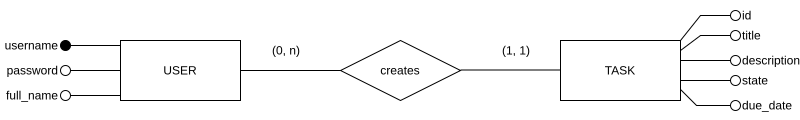

# Ejercicio 1: Lista de tareas

Queremos hacer una aplicación donde cada usuario disponga de una lista para añadir tareas y marcarlas como completadas. Los usuarios se registrarán mediante usuario y contraseña, aunque también nos interesa almacenar su nombre completo. Para cada tarea queremos almacenar su título, descripción, estado (completada, no completada) y fecha límite para completarla.

<details>
<summary>Diseño conceptual</summary>


</details>

<details>
<summary>Diseño lógico</summary>

</details>

<details>
<summary>Diseño físico</summary>

```sql


```
</details>